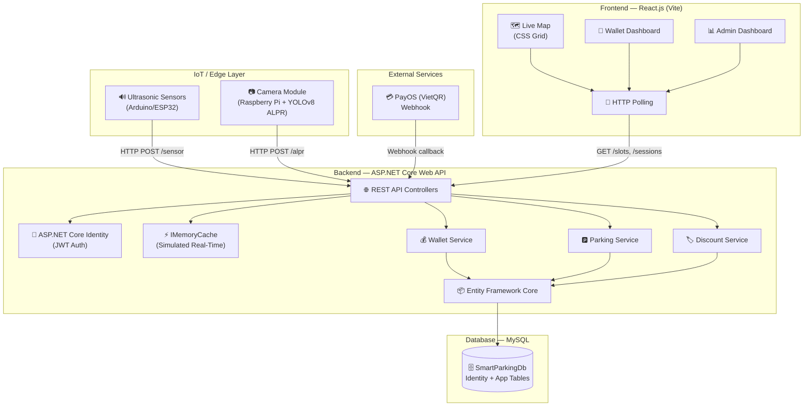

# Smart Car Parking System — High-Level Architecture

```mermaid
graph TB
    subgraph "IoT / Edge Layer"
        US["🔊 Ultrasonic Sensors<br/>(Arduino/ESP32)"]
        CAM["📷 Camera Module<br/>(Raspberry Pi + YOLOv8 ALPR)"]
    end

    subgraph "Backend — ASP.NET Core Web API"
        API["🌐 REST API Controllers"]
        AUTH["🔐 ASP.NET Core Identity<br/>(JWT Auth)"]
        EF["📦 Entity Framework Core"]
        CACHE["⚡ IMemoryCache<br/>(Simulated Real-Time)"]
        WALLETS["💰 Wallet Service"]
        PARKING["🅿️ Parking Service"]
        DISCOUNT["🏷️ Discount Service"]
    end

    subgraph "External Services"
        PAYOS["💳 PayOS (VietQR)<br/>Webhook"]
    end

    subgraph "Database — MySQL"
        DB[("🗄️ SmartParkingDb<br/>Identity + App Tables")]
    end

    subgraph "Frontend — React.js (Vite)"
        MAP["🗺️ Live Map<br/>(CSS Grid)"]
        WALLET_UI["💼 Wallet Dashboard"]
        ADMIN["📊 Admin Dashboard"]
        POLL["🔄 HTTP Polling"]
    end

    US -- "HTTP POST /sensor" --> API
    CAM -- "HTTP POST /alpr" --> API
    API --> AUTH
    API --> CACHE
    API --> WALLETS
    API --> PARKING
    API --> DISCOUNT
    WALLETS --> EF
    PARKING --> EF
    DISCOUNT --> EF
    EF --> DB
    PAYOS -- "Webhook callback" --> API
    POLL -- "GET /slots, /sessions" --> API
    MAP --> POLL
    WALLET_UI --> POLL
    ADMIN --> POLL
```
