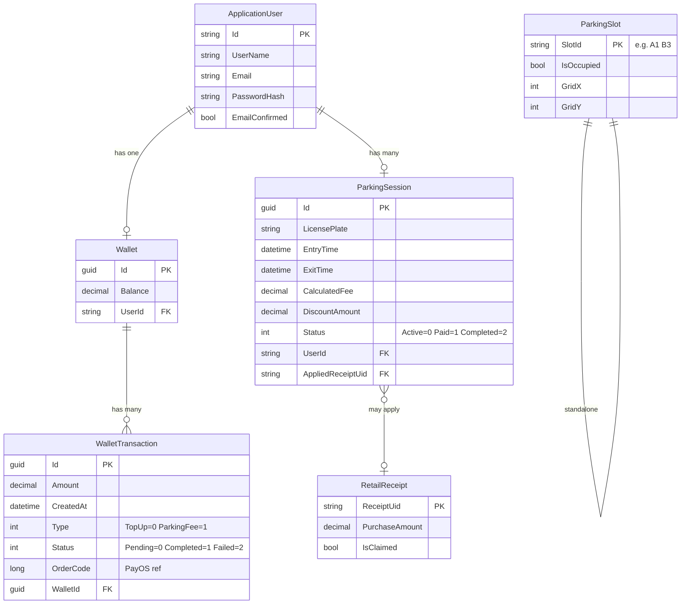

# Entity Relationship Diagram (ERD)

```mermaid
erDiagram
    ApplicationUser ||--o| Wallet : "has one"
    ApplicationUser ||--o| ParkingSession : "has many"
    Wallet ||--o{ WalletTransaction : "has many"
    ParkingSession }o--o| RetailReceipt : "may apply"
    ParkingSlot ||--|| ParkingSlot : "standalone"

    ApplicationUser {
        string Id PK
        string UserName
        string Email
        string PasswordHash
        bool EmailConfirmed
    }

    Wallet {
        guid Id PK
        decimal Balance
        string UserId FK
    }

    WalletTransaction {
        guid Id PK
        decimal Amount
        datetime CreatedAt
        int Type "TopUp=0 ParkingFee=1"
        int Status "Pending=0 Completed=1 Failed=2"
        long OrderCode "PayOS ref"
        guid WalletId FK
    }

    ParkingSlot {
        string SlotId PK "e.g. A1 B3"
        bool IsOccupied
        int GridX
        int GridY
    }

    ParkingSession {
        guid Id PK
        string LicensePlate
        datetime EntryTime
        datetime ExitTime
        decimal CalculatedFee
        decimal DiscountAmount
        int Status "Active=0 Paid=1 Completed=2"
        string UserId FK
        string AppliedReceiptUid FK
    }

    RetailReceipt {
        string ReceiptUid PK
        decimal PurchaseAmount
        bool IsClaimed
    }
```
