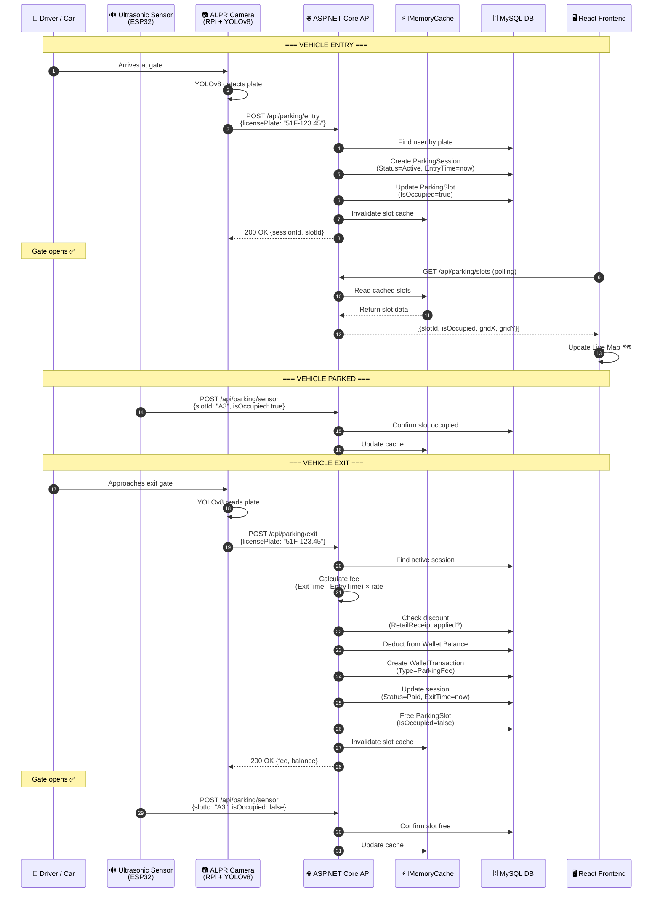

# Parking Entry → Park → Exit Flow

```mermaid
sequenceDiagram
    autonumber
    participant Car as 🚗 Driver / Car
    participant Sensor as 🔊 Ultrasonic Sensor<br/>(ESP32)
    participant Camera as 📷 ALPR Camera<br/>(RPi + YOLOv8)
    participant API as 🌐 ASP.NET Core API
    participant Cache as ⚡ IMemoryCache
    participant DB as 🗄️ MySQL DB
    participant React as 🖥️ React Frontend

    Note over Car,React: === VEHICLE ENTRY ===

    Car->>Camera: Arrives at gate
    Camera->>Camera: YOLOv8 detects plate
    Camera->>API: POST /api/parking/entry<br/>{licensePlate: "51F-123.45"}
    API->>DB: Find user by plate
    API->>DB: Create ParkingSession<br/>(Status=Active, EntryTime=now)
    API->>DB: Update ParkingSlot<br/>(IsOccupied=true)
    API->>Cache: Invalidate slot cache
    API-->>Camera: 200 OK {sessionId, slotId}
    Note over Car: Gate opens ✅

    React->>API: GET /api/parking/slots (polling)
    API->>Cache: Read cached slots
    Cache-->>API: Return slot data
    API-->>React: [{slotId, isOccupied, gridX, gridY}]
    React->>React: Update Live Map 🗺️

    Note over Car,React: === VEHICLE PARKED ===

    Sensor->>API: POST /api/parking/sensor<br/>{slotId: "A3", isOccupied: true}
    API->>DB: Confirm slot occupied
    API->>Cache: Update cache

    Note over Car,React: === VEHICLE EXIT ===

    Car->>Camera: Approaches exit gate
    Camera->>Camera: YOLOv8 reads plate
    Camera->>API: POST /api/parking/exit<br/>{licensePlate: "51F-123.45"}
    API->>DB: Find active session
    API->>API: Calculate fee<br/>(ExitTime - EntryTime) × rate
    API->>DB: Check discount<br/>(RetailReceipt applied?)
    API->>DB: Deduct from Wallet.Balance
    API->>DB: Create WalletTransaction<br/>(Type=ParkingFee)
    API->>DB: Update session<br/>(Status=Paid, ExitTime=now)
    API->>DB: Free ParkingSlot<br/>(IsOccupied=false)
    API->>Cache: Invalidate slot cache
    API-->>Camera: 200 OK {fee, balance}
    Note over Car: Gate opens ✅

    Sensor->>API: POST /api/parking/sensor<br/>{slotId: "A3", isOccupied: false}
    API->>DB: Confirm slot free
    API->>Cache: Update cache
```
