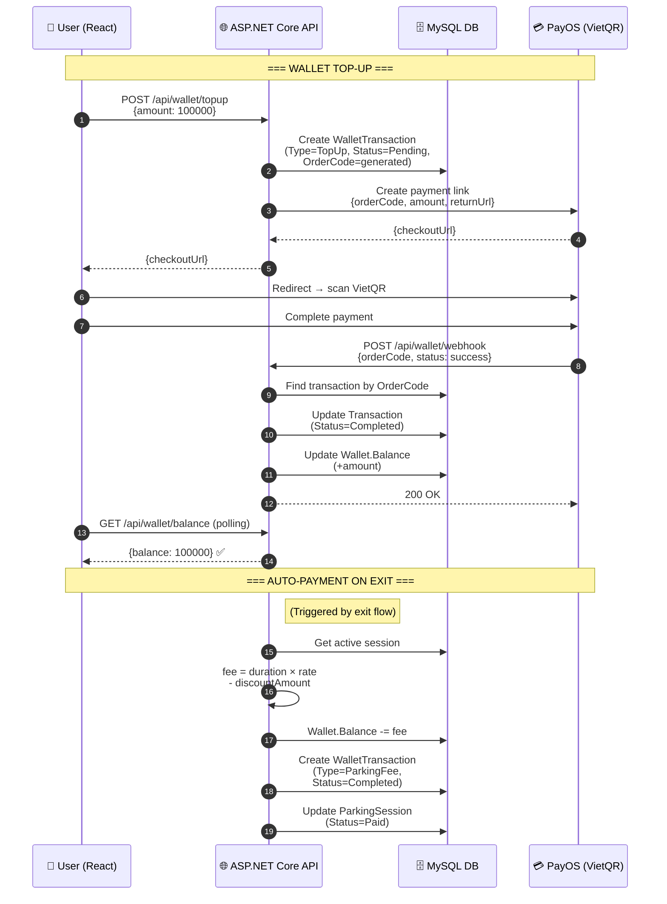

# Wallet Top-Up & Auto-Payment Flow

```mermaid
sequenceDiagram
    autonumber
    participant User as 👤 User (React)
    participant API as 🌐 ASP.NET Core API
    participant DB as 🗄️ MySQL DB
    participant PayOS as 💳 PayOS (VietQR)

    Note over User,PayOS: === WALLET TOP-UP ===

    User->>API: POST /api/wallet/topup<br/>{amount: 100000}
    API->>DB: Create WalletTransaction<br/>(Type=TopUp, Status=Pending,<br/>OrderCode=generated)
    API->>PayOS: Create payment link<br/>{orderCode, amount, returnUrl}
    PayOS-->>API: {checkoutUrl}
    API-->>User: {checkoutUrl}
    User->>PayOS: Redirect → scan VietQR
    User->>PayOS: Complete payment
    PayOS->>API: POST /api/wallet/webhook<br/>{orderCode, status: success}
    API->>DB: Find transaction by OrderCode
    API->>DB: Update Transaction<br/>(Status=Completed)
    API->>DB: Update Wallet.Balance<br/>(+amount)
    API-->>PayOS: 200 OK
    User->>API: GET /api/wallet/balance (polling)
    API-->>User: {balance: 100000} ✅

    Note over User,PayOS: === AUTO-PAYMENT ON EXIT ===

    Note right of API: (Triggered by exit flow)
    API->>DB: Get active session
    API->>API: fee = duration × rate<br/>- discountAmount
    API->>DB: Wallet.Balance -= fee
    API->>DB: Create WalletTransaction<br/>(Type=ParkingFee,<br/>Status=Completed)
    API->>DB: Update ParkingSession<br/>(Status=Paid)
```
