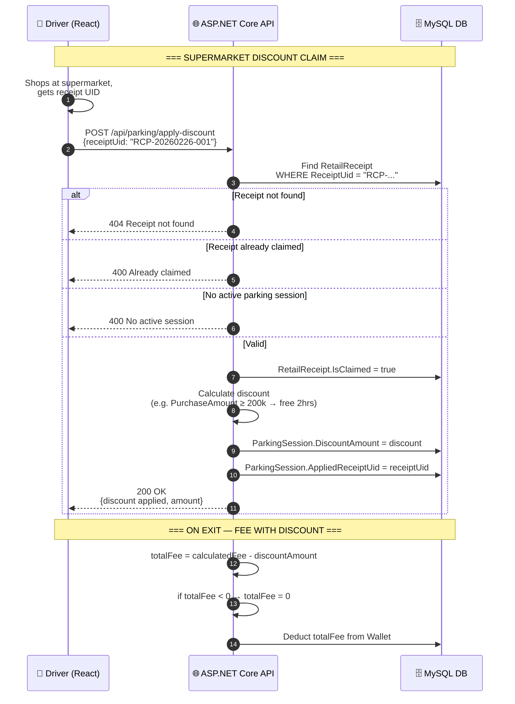

# Supermarket Discount Claim Flow

```mermaid
sequenceDiagram
    autonumber
    participant User as 👤 Driver (React)
    participant API as 🌐 ASP.NET Core API
    participant DB as 🗄️ MySQL DB

    Note over User,DB: === SUPERMARKET DISCOUNT CLAIM ===

    User->>User: Shops at supermarket,<br/>gets receipt UID
    User->>API: POST /api/parking/apply-discount<br/>{receiptUid: "RCP-20260226-001"}
    API->>DB: Find RetailReceipt<br/>WHERE ReceiptUid = "RCP-..."
    
    alt Receipt not found
        API-->>User: 404 Receipt not found
    else Receipt already claimed
        API-->>User: 400 Already claimed
    else No active parking session
        API-->>User: 400 No active session
    else Valid
        API->>DB: RetailReceipt.IsClaimed = true
        API->>API: Calculate discount<br/>(e.g. PurchaseAmount ≥ 200k → free 2hrs)
        API->>DB: ParkingSession.DiscountAmount = discount
        API->>DB: ParkingSession.AppliedReceiptUid = receiptUid
        API-->>User: 200 OK<br/>{discount applied, amount}
    end

    Note over User,DB: === ON EXIT — FEE WITH DISCOUNT ===

    API->>API: totalFee = calculatedFee - discountAmount
    API->>API: if totalFee < 0 → totalFee = 0
    API->>DB: Deduct totalFee from Wallet
```
